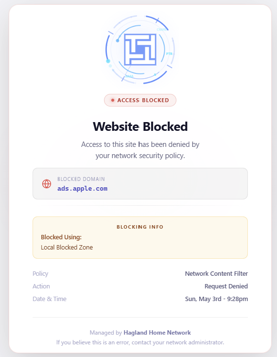
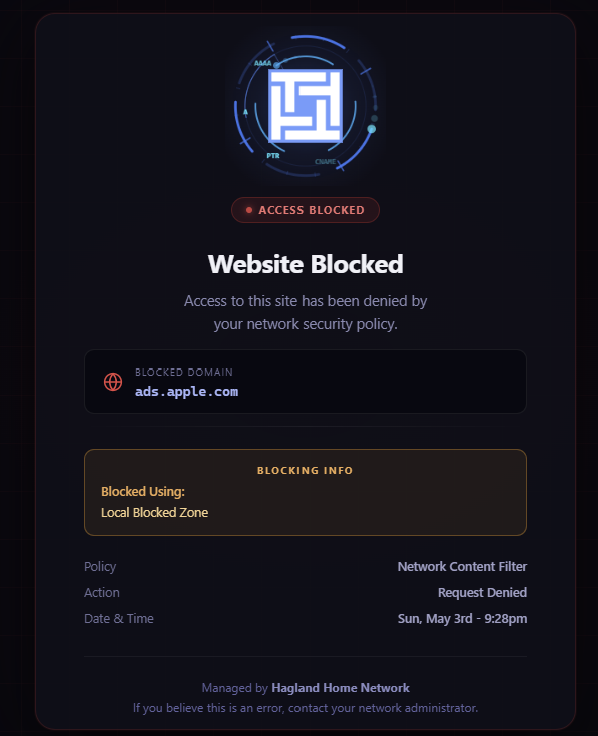
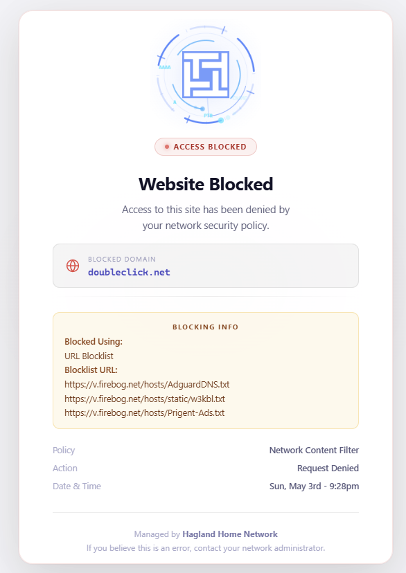

# TDNS-BlockPage
A custom block page for [Technitium DNS Server](https://technitium.com/dns/) with light/dark mode support, animated splash logo, and detailed blocking info.
This is ONLY available on V15.1 onwards.

## Features

- Responsive light/dark theme following system preference
- Animated spinning logo (matching the Technitium DNS Android app)
- Displays blocked domain, block reason (Local Block Zone or URL Blocklist), and blocklist URLs
- Red shield favicon

## Demo

[▶ Download demo video](https://github.com/Hemsby/TDNS-BlockPage/raw/main/screenshots/block-page-demo.mp4)

## Screenshots

| Light mode | Dark mode |
|---|---|
|  |  |

### URL Blocklist detail (light mode)

## Prerequisites — Pending PR

The `{BLOCKING-INFO}` placeholder that powers the detailed blocking info cards relies on a fix that has been submitted to the Technitium DNS Server project but **has not yet been merged or released**. Without it, the placeholder is not substituted when serving a custom static `index.html` from the web server root.

> **PR:** [TechnitiumSoftware/DnsServer #1897](https://github.com/TechnitiumSoftware/DnsServer/pull/1897)

Until the PR is merged and included in an official release, you can use the patched `BlockPageApp.dll` included in this repo to get the feature working today.

### Applying the patched DLL

1. Find your Technitium DNS installation folder (typically `/etc/dns/` on Linux or `C:\Program Files\Technitium\DNS Server\` on Windows).
2. Inside that folder, open `apps\Block Page App\`.
3. Stop the Technitium DNS service.
4. Replace `BlockPageApp.dll` with the one from this repo.
5. Restart the Technitium DNS service.

> **Note:** The patched DLL will be overwritten if you update the Block Page App through the Technitium UI. Re-apply after any app update until the PR is merged.

## Installation

1. In Technitium DNS, install the **Block Page App** from the Apps section.
2. In the app settings, enable **Serve block page from web server root** and point it at the folder containing `index.html`.
3. Replace (or add) `index.html` with the one from this repo.

## EDNS EDE Info

The page parses the `{BLOCKING-INFO}` placeholder injected by Technitium and formats it into human-readable cards showing:
- **Blocked by:** Local Block Zone or URL Blocklist
- **Blocklist URL(s):** the source list(s) the domain was found on
